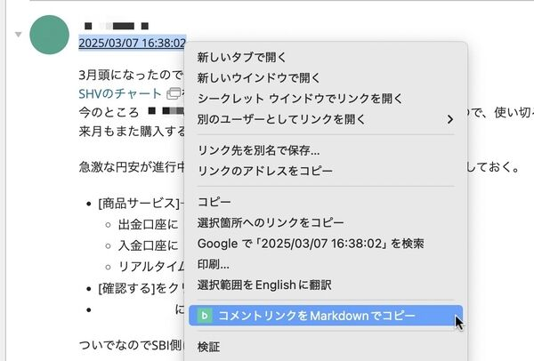

# Backlog Comment Link Copier

[](https://opensource.org/licenses/MIT) [](https://developer.chrome.com/docs/extensions/) [](https://developer.chrome.com/docs/extensions/mv3/intro/) [](https://github.com/yourusername/backlog-commentlink)

A Chrome extension that allows you to copy Markdown-formatted links to Backlog comments by right-clicking on the comment timestamp.



## Features

- Works only on Backlog ticket detail pages (`https://*.backlog.jp/view/*`, `https://*.backlog.com/view/*`)
- Displays a context menu item when right-clicking on a comment timestamp
- Copies a Markdown-formatted link to the clipboard
- Shows a notification when the link is successfully copied
- Customizable settings for selectors and domains

## Installation

1. Clone or download this repository
2. Open Chrome and navigate to `chrome://extensions/`
3. Enable "Developer mode" in the top-right corner
4. Click "Load unpacked" and select the directory containing the extension files
5. The extension should now be installed and ready to use

## Usage

1. Navigate to a Backlog ticket detail page
2. Right-click on a comment timestamp (the date/time link)
3. Select "コメントリンクをMarkdownでコピー" from the context menu
4. The Markdown-formatted link will be copied to your clipboard
5. A notification will appear to confirm the successful copy

## Generated Markdown Link Format

```
[[PROJECT-123]] [2025/03/07 09:55:14](https://example.backlog.jp/view/PROJECT-123#comment-266455529)
```

## Settings

Click on the extension icon to open the settings page, where you can customize:

- Comment timestamp selector (for when Backlog's HTML structure changes)
- Backlog domains (for multiple Backlog instances) - Enter one domain per line

## Technical Details

This extension uses:
- Manifest V3
- Chrome Storage API for settings
- Context Menus API for the right-click menu
- Clipboard API for copying text
- DOM manipulation for notifications

## Permissions

- `contextMenus`: To create the right-click menu item
- `activeTab`: To access the current tab's content
- `scripting`: To execute scripts in the page context
- `clipboardWrite`: To write to the clipboard
- `storage`: To save and load settings

## Development Notes

This extension was initially generated by AI (Claude) and then verified and modified by humans. The implementation includes:

1. Core functionality to extract and format Backlog comment links
2. Settings page for customization
3. Context menu integration
4. Notification system
5. Custom icons in multiple sizes (16x16, 48x48, 128x128)

The code has been reviewed and tested to ensure proper functionality in real Backlog environments.

## License

[MIT License](LICENSE)
